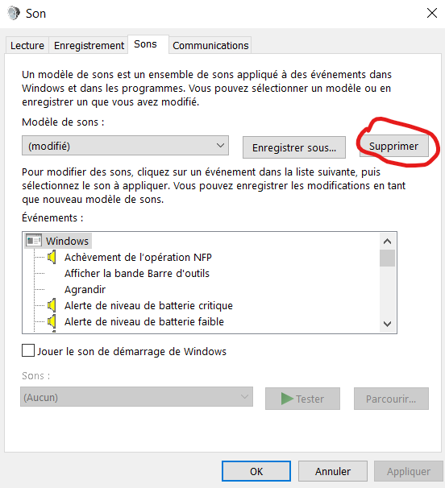

# Yamete

Stupid script to change device connect / disconnect sounds on Windows

## Usage

Copy the content of `set_yamete_usb.bat`, open a Windows command prompt, and paste.

## Reset

- Open the "Modify system sound" item from start menu
- Delete the custom sound scheme
- Click 'OK' or 'Apply'

